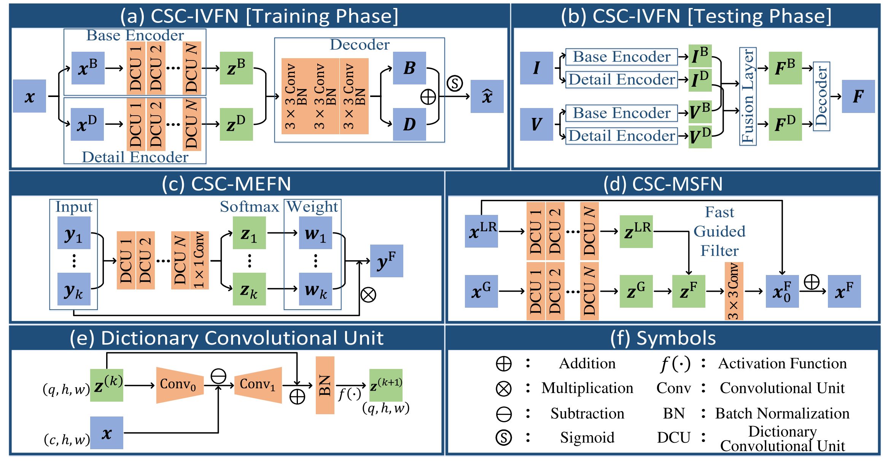

# CSCFuse (CVPR Workshop 2023)
Codes for ***Deep Convolutional Sparse Coding Networks for Interpretable Image Fusion.***

Zixiang Zhao, Jiangshe Zhang, Haowen Bai, Yicheng Wang, Yukun Cui, Lilun Deng, Kai Sun, Chunxia Zhang, Junmin Liu, Shuang Xu

[Paper](https://robustart.github.io/long_paper/26.pdf)

## Citation

```
@inproceedings{DBLP:conf/cvpr/ZhaoZBWCDSZLX23,
  author       = {Zixiang Zhao and
                  Jiang{-}She Zhang and
                  Haowen Bai and
                  Yicheng Wang and
                  Yukun Cui and
                  Lilun Deng and
                  Kai Sun and
                  Chunxia Zhang and
                  Junmin Liu and
                  Shuang Xu},
  title        = {Deep Convolutional Sparse Coding Networks for Interpretable Image
                  Fusion},
  booktitle    = {{CVPR} Workshops},
  pages        = {2369--2377},
  publisher    = {{IEEE}},
  year         = {2023}
}
```

## Abstract
Image fusion is a significant problem in many fields including digital photography, computational imaging and remote sensing, to name but a few. Recently, deep learning has emerged as an important tool for image fusion. This paper presents CSCFuse, which contains three deep convolutional sparse coding (CSC) networks for three kinds of image fusion tasks (i.e., infrared and visible image fusion, multi-exposure image fusion, and multi-spectral image fusion). The CSC model and the iterative shrinkage and thresholding algorithm are generalized into dictionary convolution units. As a result, all hyper-parameters are learned from data. Our extensive experiments and comprehensive comparisons reveal the superiority of CSCFuse with regard to quantitative evaluation and visual inspection.

## Software
#### Infrared-Visible Image Fusion: [Folder CSC-IVF](CSC-IVF/README.md)
#### Multi-Exposure Image Fusion: [Folder CSC-MEF](CSC-MEF/README.md)
####  Multi-Spectral Image Fusio: [Folder CSC-MSF](CSC-MSF/README.md)

## CSC Unfolding
The convolutional sparse coding (CSC) optimizes the following problem,

<div align=center>
<a href="https://www.codecogs.com/eqnedit.php?latex=\min_{\boldsymbol&space;z}\frac{1}{2}\|\boldsymbol{x}-\boldsymbol{d}*\boldsymbol{z}\|_2^2&plus;\lambda&space;g(\boldsymbol{z})" target="_blank"></a>
</div>

where <a href="https://www.codecogs.com/eqnedit.php?latex=\lambda" target="_blank"></a> is a hyperparameter, * denotes the convolution operator, <a href="https://www.codecogs.com/eqnedit.php?latex=\boldsymbol{z}\in&space;R^{q\times&space;h&space;\times&space;w}" target="_blank"></a> is the sparse feature map (or say, code) and <a href="https://www.codecogs.com/eqnedit.php?latex=g(\cdot)" target="_blank"></a> is a sparse regularizer. This problem can be solved by ISTA, and its updating rule is as below,

<div align=center>
<a href="https://www.codecogs.com/eqnedit.php?latex=\boldsymbol{z}^{(k&plus;1)}&space;\leftarrow&space;\mathrm{prox}_{\lambda/\rho}\left(\boldsymbol{z}^{(k)}&plus;\frac{1}{\rho}\boldsymbol{d}^T*(\boldsymbol{x}-\boldsymbol{d}*\boldsymbol{z}^{(k)})\right)." target="_blank"></a>
</div>

We replace some operations with deep neural networks' elements and rewritten the updating rule, that is, 

<div align=center>
<a href="https://www.codecogs.com/eqnedit.php?latex=\boldsymbol{z}^{(k&plus;1)}&space;=&space;f\left(&space;{\rm&space;BN}\left(&space;\boldsymbol{z}^{(k)}&plus;\mathrm{Conv}_1(\boldsymbol{x}-\mathrm{Conv}_0(\boldsymbol{z}^{(k)}))&space;\right)&space;\right)." target="_blank"></a>
</div>

The above equation is called as the dictnary convolutional unit (DCU).

## Network Structure
In our paper, DCUs are regarded as the hidden layers of deep networks. Then, we design three kinds of networks for infrared-visible image fusion, multi-epxosure image fusion, and multi-spectral image fusion, as shown in the following figure.


